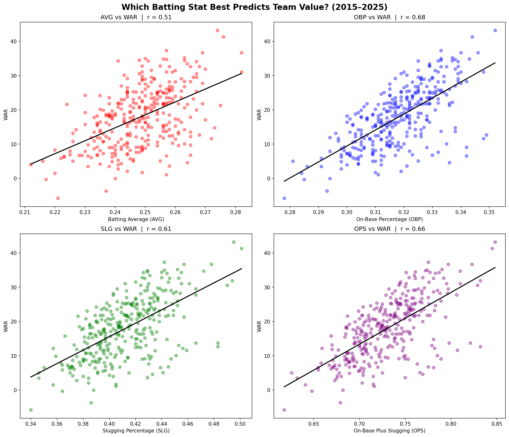

# Batting Stats Analysis

An exploration of which batting statistics best predict team offensive value using 11 years of MLB data (2015–2025).

## Question
The Moneyball era challenged traditional baseball thinking — but which 
batting stat actually predicts team value best in the modern game?

## Findings
| Stat | Correlation with WAR |
|------|----------------------|
| OBP  | 0.68                 |
| OPS  | 0.66                 |
| SLG  | 0.61                 |
| AVG  | 0.51                 |

OBP was the strongest predictor — even beating OPS, which is widely 
considered the superior all-in-one batting stat. This suggests that 
getting on base matters more than hitting for power when it comes to 
overall team offensive value.

## Tools & Data
- **Python** — matplotlib, numpy
- **pybaseball** — data pulled from FanGraphs via the pybaseball library
- **Data:** 330 team-seasons across 30 MLB teams (2015–2025)

## How to Run
pip install pybaseball pandas matplotlib numpy  
python obp_wins_analysis.py

## Visual

